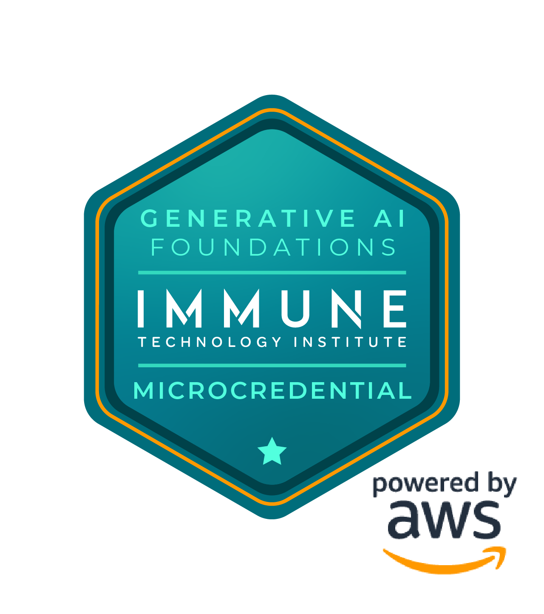

# Hola, soy Francisco Blázquez 👋 

**Junior ABAP Developer | SAP ECC & Cloud | AWS Developer & CCST Cybersecurity**

---

## 🚀 Actualmente estoy aprendiendo y creciendo en:

- Desarrollo en la nube con AWS (AWS Certified Developer – Associate en curso)
- Ciberseguridad con Cisco CCST Cybersecurity
- Programación y automatización en ABAP para SAP S/4HANA Cloud

---

## 💼 Sobre mí

Soy un profesional con formación técnica en informática y certificación oficial en desarrollo ABAP para entornos SAP, con experiencia en automatización de procesos y mejora documental en ambientes regulados. Me destaco por mi enfoque analítico, estructurado y orientado a la resolución de problemas, con una base científica sólida.

---

## 🎓 Certificaciones y formación

- 🟢 **SAP Certified Associate – Back-End Developer – ABAP Cloud**
- ☁️ **AWS Certified Developer – Associate** *(en curso)*
- 🔐 **Cisco CCST – Cybersecurity** *(en curso)*
- 🤖 **Diplomado en Inteligencia Artificial – UCatalunya**
- 💻 **Técnico de Nivel Superior en Informática – IACC (Chile)**

  
  &nbsp;&nbsp;&nbsp;&nbsp;&nbsp;&nbsp;&nbsp;&nbsp;&nbsp;&nbsp;&nbsp;&nbsp;&nbsp;&nbsp;&nbsp; <!-- Añade más &nbsp; si necesitas -->
  

---

## 📫 ¿Quieres contactarme?

- [LinkedIn](https://www.linkedin.com/in/francisco-blazquez-weber/)
- [Email](mailto:fblazquezweber@gmail.com)

---
